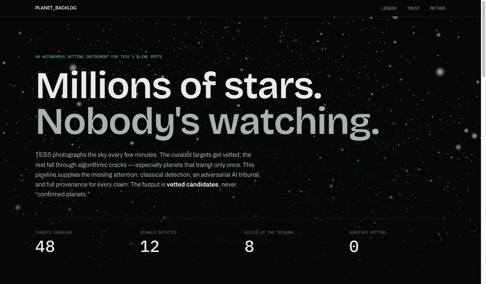
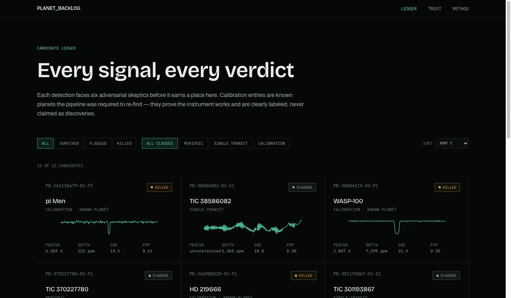
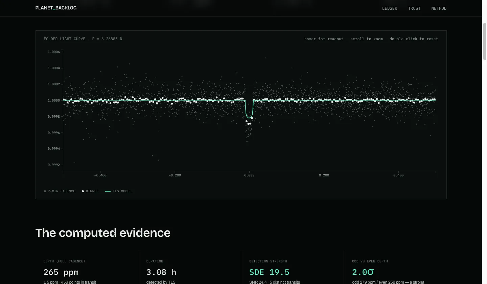
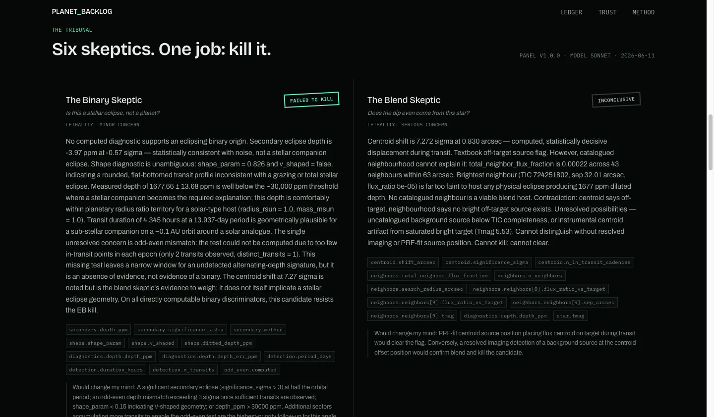
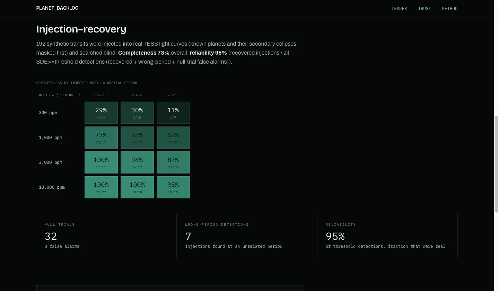

# PLANET BACKLOG

An autonomous exoplanet-candidate discovery and vetting system for TESS's blind spots —
classical algorithms detect transit signals, an adversarial AI tribunal tries to kill
every candidate, and survivors are published as fully-provenanced dossiers on a static
web experience.

**Everything this system outputs is a *vetted candidate*, never a "confirmed planet."**
Confirmation requires radial-velocity follow-up, which is out of scope. Candidates are
framed ExoFOP-style: for community follow-up.

## Why

TESS observes millions of stars; NASA/MIT pipelines vet a curated subset. Citizen
scientists keep finding real planets in the leftovers by eye — proof the bottleneck is
attention, not data. Long-period **single-transit events** are the starkest gap:
periodic searches need ≥ 2 transits, so a planet that transits once per sector is
invisible to them by construction. This system supplies that attention at scale.

## Honest results (this run)

| What | Result |
|---|---|
| Known-planet recovery (calibration gate) | **8/8 (100%)** — WASP-18 b, WASP-121 b, WASP-126 b, WASP-100 b, WASP-62 b, pi Men c, LHS 3844 b, HD 219666 b all re-found blind; pi Men c at 221 ppm is the depth floor demonstrated |
| Injection-recovery completeness | **73%** overall — 192 trapezoid injections into RAW flux, searched through the full production detrend+search chain (≥93% at ≥3000 ppm, ~20–40% at 300 ppm: the honest small-planet limit at 10-min binning). An earlier 81% figure that bypassed detrending was caught in adversarial review and corrected. |
| Reliability | **95%** (recovered injections / all SDE ≥ 9 detections, incl. block-shuffle null-trial false alarms and wrong-period recoveries — full accounting in `data/calibration.json`) |
| Blind backlog batch | 40 sector-1 SPOC targets not in any TOI/confirmed/EB catalog: **37 honest no-detections**, 1 periodic candidate, 3 single-transit events (period lower bounds 18.1–22.2 d, event-to-edge) |
| Tribunal verdicts | all 8 calibration planets correctly killed by the catalog skeptic ("not novel" — dedup proof); all 4 novel candidates **flagged for human review** with low-confidence judge syntheses and concrete follow-up plans; **0 survivors** — the honest outcome for single-sector evidence. Notably, the blend skeptic surfaced a real 7.3σ in-transit centroid shift on the periodic candidate. Every skeptic's full reasoning is in `data/candidates.json`. |

Caveats, stated plainly:

- The false-positive number is **heuristic-fpp-v1** — a transparent, documented ranking
  score (formula in `pipeline/validate.py`, published verbatim on the site's Method
  page). It is **not** a Bayesian FPP; TRICERATOPS integration is future work.
- Hot Jupiters in the calibration set score "suspicious" on that heuristic *because they
  really do have secondary eclipses* — a known, visible limitation, not a hidden one.
- The periodic blind candidate sits at the period-search grid edge (13.94 d), a classic
  alias signature; the tribunal weighs exactly that.
- Injection-recovery used hundreds of trials (single-session compute), not thousands;
  scope is recorded in `data/calibration.json`.
- The Villanova TESS-EB catalog endpoint was unreachable during this run; EB dedup relies
  on TFOPWG FP dispositions + the confirmed/TOI lists. Recorded in every dossier's
  `catalog_status`.
- This repo was built and adversarially reviewed in a single session by Claude (Fable 5)
  on real MAST data; the review found and fixed two genuine science defects (injection
  path bypassing detrending; single-transit period bound overstated) before publication.

## The experience







## Architecture

Two decoupled layers joined by a JSON contract (`data/`):

```
pipeline/      Layer A — deterministic Python. ingest (lightkurve/MAST, SPOC 2-min
               PDCSAP) → detrend (transit-safe Savitzky-Golay) → search (TLS + BLS
               cross-check) → diagnostics (odd-even, secondary w/ bootstrap, trapezoid
               shape, TPF centroid shift, TIC-cone neighbors, systematics flags,
               rotation aliases) → single-transit matched filter → heuristic FPP →
               catalog crossmatch (TOI / NASA confirmed / EB best-effort)
panel/         Layer B — adversarial AI. Six skeptics (binary, blend, instrument,
               stellar, alias, catalog) + a judge, driven through headless `claude -p`
               with strict JSON schemas. Skeptics reason ONLY over computed diagnostics;
               physical skeptics are blind to catalog matches. Survival is enforced by
               a mechanical rule in code — the judge cannot override a fatal kill.
calibration/   The trust gate: known-planet recovery + injection-recovery (completeness,
               reliability, 1-day block-shuffle null trials). Runs BEFORE any claim.
data/          The contract: candidates.json, calibration.json, run-meta.json.
web/           Next.js 16 static export. Renders ENTIRELY from data/*.json — no number
               on the site exists outside the pipeline output.
tests/         pytest: synthetic recovery, EB-tell diagnostics, single-transit hunter,
               contract integrity (15 tests).
```

**The prime directive: the LLM never invents a number.** Every quantity is computed in
`pipeline/`; the AI layer interprets, argues, and writes prose. Diagnostics that could
not be computed are reported as `computed: false` with a reason — missing evidence is
never papered over.

## Run it

```bash
# environment (Python 3.12)
python3.12 -m venv .venv
.venv/bin/pip install numpy scipy matplotlib astropy lightkurve astroquery \
                      transitleastsquares pytest pandas jsonschema requests setuptools

# 1. calibration gate (downloads real TESS data from MAST; ~1 h)
.venv/bin/python -m calibration.run

# 2. science pipeline: calibration hosts + blind backlog batch
.venv/bin/python -m pipeline.run --calibration --blind

# 3. adversarial tribunal (needs the Claude Code CLI authenticated)
.venv/bin/python -m panel.run

# 4. the site
cd web && npm install && npm run build   # static export in web/out/

# tests
.venv/bin/pytest tests/
```

## Provenance

Every dossier records TIC ID, sector, data product, pipeline + contract versions,
generation time, stellar-parameter source, every diagnostic, every skeptic verdict, and
the folded light-curve series — exportable as JSON from each dossier page for
independent verification or refutation.
